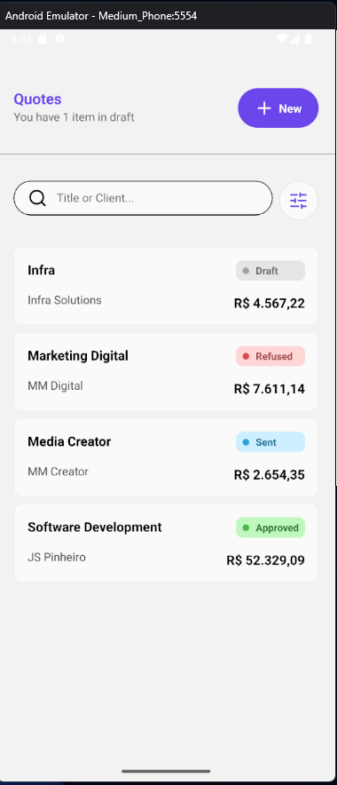
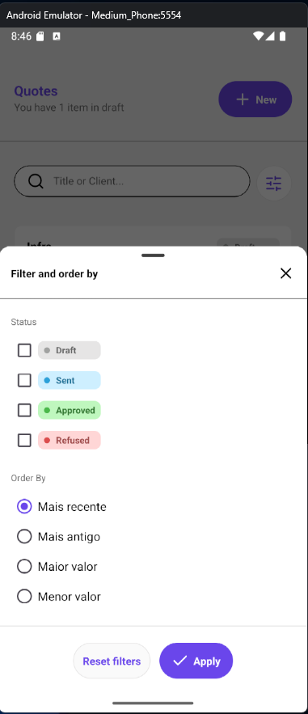
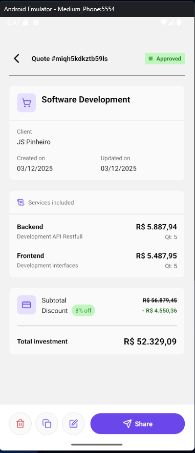
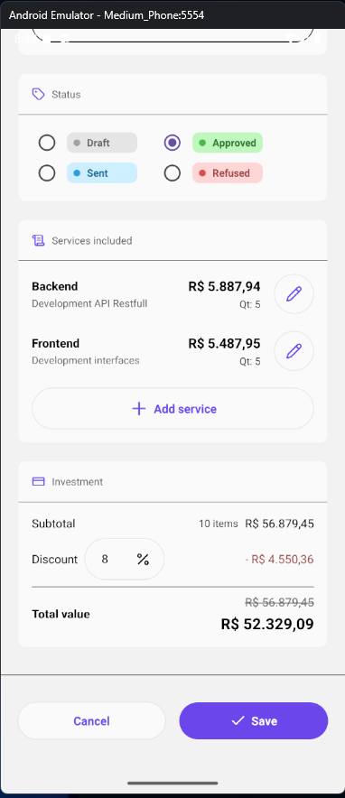

# 📋 RN Service Quote

> Aplicativo mobile para criação e gestão de cotações de serviços, desenvolvido com React Native e Expo.

## 📱 Screenshots

<div align="center">
  
  
  
  
</div>

## ✨ Funcionalidades

### 📝 Gestão de Cotações

- ✅ **Criar** cotações com múltiplos serviços
- ✅ **Editar** cotações existentes
- ✅ **Copiar** cotações para reutilização
- ✅ **Deletar** cotações
- ✅ **Status** personalizados (Draft, Sent, Approved, Refused)
- ✅ **Descontos** por porcentagem com cálculo automático

### 🔍 Busca e Filtros

- ✅ **Busca** por título ou cliente (com debounce de 1s)
- ✅ **Filtros** por status (múltipla seleção)
- ✅ **Ordenação** por:
  - Mais recente
  - Mais antigo
  - Maior valor
  - Menor valor

### 📊 Serviços

- ✅ **Adicionar** múltiplos serviços por cotação
- ✅ **Editar** serviços existentes
- ✅ **Remover** serviços
- ✅ **Quantidade** configurável por serviço
- ✅ **Cálculo automático** de subtotal e total

### 💾 Persistência

- ✅ Armazenamento local com **AsyncStorage**
- ✅ Dados persistem entre sessões
- ✅ Sincronização automática de serviços por cotação

### 🎨 Interface

- ✅ Design moderno e intuitivo
- ✅ Bottom Sheets para filtros e formulários
- ✅ Validação de formulários com **React Hook Form** e **Zod**
- ✅ Mensagens de erro contextuais
- ✅ Formatação de moeda brasileira (BRL)
- ✅ Formatação de datas em português

## 🛠️ Tecnologias

### Core

- **[React Native](https://reactnative.dev/)** - Framework mobile
- **[Expo](https://expo.dev/)** `~54.0.25` - Plataforma de desenvolvimento
- **[TypeScript](https://www.typescriptlang.org/)** `~5.9.2` - Tipagem estática

### Navegação

- **[@react-navigation/stack](https://reactnavigation.org/)** `^7.6.8` - Navegação em pilha

### Formulários & Validação

- **[React Hook Form](https://react-hook-form.com/)** `^7.67.0` - Gerenciamento de formulários
- **[Zod](https://zod.dev/)** via `@hookform/resolvers` `^5.2.2` - Validação de schemas

### UI/UX

- **[@gorhom/bottom-sheet](https://gorhom.dev/react-native-bottom-sheet/)** `^5.2.7` - Bottom sheets modernos
- **[react-native-paper](https://callstack.github.io/react-native-paper/)** `^5.14.5` - Componentes Material Design
- **[lucide-react-native](https://lucide.dev/)** `^0.555.0` - Ícones

### Gesture & Animation

- **[react-native-gesture-handler](https://docs.swmansion.com/react-native-gesture-handler/)** `~2.28.0` - Gestos nativos
- **[react-native-reanimated](https://docs.swmansion.com/react-native-reanimated/)** `~4.1.1` - Animações performáticas

### Storage

- **[@react-native-async-storage/async-storage](https://react-native-async-storage.github.io/async-storage/)** `^2.2.0` - Persistência de dados

### Datas

- **[dayjs](https://day.js.org/)** `^1.11.19` - Manipulação de datas (configurado para pt-BR)

## 🚀 Como Rodar

### Pré-requisitos

- Node.js (v18+)
- npm ou yarn
- Android Studio (para Android) ou Xcode (para iOS)
- Expo Go (opcional, para teste rápido)

### Instalação

1. **Clone o repositório**

```bash
git clone https://github.com/seu-usuario/rn-service-quote.git
cd rn-service-quote
```

2. **Instale as dependências**

```bash
npm install
```

3. **Inicie a build de desenvolvimento (emulador aberto)**

```bash
npx run android
```

4. **Depois de feito a build pela primeira vez ou quando precisar**

```bash
npm run start

// tecla "s" para mudar para build de desenvolvimento e "a" para abrir no emulador
```

## 📂 Estrutura do Projeto

```
rn-service-quote/
├── src/
│   ├── app/                          # Screens
│   │   ├── CreateOrUpdateQuote/      # Criar/Editar cotação
│   │   │   └── components/           # Componentes específicos
│   │   ├── DetailsQuote/             # Detalhes da cotação
│   │   └── QuoteList/                # Lista e filtros
│   │       └── components/           # Componentes específicos
│   ├── components/                   # Componentes compartilhados
│   │   ├── Button/
│   │   ├── Card/
│   │   ├── CustomText/
│   │   ├── Status/
│   │   ├── TextField/
│   │   └── ...
│   ├── config/                       # Configurações
│   │   └── dayjs.ts                  # Configuração de datas (pt-BR)
│   ├── constants/                    # Valores padrão
│   │   ├── filterQuoteList.ts
│   │   ├── quote.ts
│   │   └── service.ts
│   ├── routes/                       # Navegação
│   │   └── StackRoutes.tsx
│   ├── schemas/                      # Validação Zod
│   │   ├── filterQuoteList.ts
│   │   ├── quote.ts
│   │   └── service.ts
│   ├── storage/                      # AsyncStorage
│   │   ├── quoteStorage.ts           # CRUD de cotações
│   │   └── serviceStorage.ts         # CRUD de serviços
│   ├── styles/                       # Estilos globais
│   │   ├── colors.ts
│   │   ├── sizes.ts
│   │   └── weights.ts
│   ├── types/                        # TypeScript types
│   │   ├── filterQuoteList.ts
│   │   ├── orderBy.ts
│   │   ├── quote.ts
│   │   ├── service.ts
│   │   └── status.ts
│   └── utils/                        # Utilitários
│       ├── formatCurrencyBRL.ts      # Formata moeda
│       ├── formatDate.ts             # Formata datas
│       ├── generateId.ts             # Gera IDs únicos
│       └── parseInCents.ts           # Parse de valores
├── .github/
│   └── screenshots/                  # Screenshots do app
├── App.tsx                           # Componente raiz
├── index.js                          # Entry point
└── package.json
```

## 🎯 Fluxo de Uso

### 1️⃣ Criar Nova Cotação

1. Na tela principal, clique em **"New"**
2. Preencha título e cliente
3. Selecione o status
4. Adicione serviços com **"Add service"**
5. Configure desconto (opcional)
6. Clique em **"Save"**

### 2️⃣ Filtrar Cotações

1. Use a barra de busca para filtrar por título/cliente
2. Clique no ícone de filtro
3. Selecione status desejados
4. Escolha ordenação
5. Clique em **"Apply"**

### 3️⃣ Copiar Cotação

1. Abra os detalhes da cotação
2. Clique no ícone de **copiar**
3. Uma nova cotação será criada com os mesmos dados

### 4️⃣ Editar Cotação

1. Abra os detalhes da cotação
2. Clique no ícone de **editar**
3. Faça as alterações necessárias
4. Clique em **"Save"**

## 🗂️ Schemas de Dados

### Quote (Cotação)

```typescript
{
  id: string
  title: string                    // Min: 5, Max: 80
  client: string                   // Min: 1, Max: 80
  status: STATUS                   // DRAFT | SENT | APPROVED | REFUSED
  subtotalInCents: number
  discount: {
    percentage: number             // 0-100
    amountInCents: number
  }
  totalInCents: number
  createdAt: Date
  updatedAt?: Date
}
```

### Service (Serviço)

```typescript
{
  id: string
  title: string
  description: string
  qtd: number
  totalInCents: number
  createdAt: Date
  updatedAt?: Date
}
```

## 🔧 Scripts Disponíveis

```bash
npm start          # Inicia o Expo Dev Server
npm run android    # Roda no Android
npm run ios        # Roda no iOS
npm run web        # Roda no navegador
```

## 📝 Melhorias Futuras

- [ ] Export de cotações em PDF
- [ ] Compartilhamento via WhatsApp/Email
- [ ] Gráficos e estatísticas
- [ ] Modo escuro
- [ ] Backup na nuvem
- [ ] Histórico de versões
- [ ] Templates de cotações
- [ ] Assinatura digital

## 👨‍💻 Desenvolvedor

Desenvolvido por **Felipe Pinheiro**

## 📄 Licença

Este projeto está sob a licença MIT.

---

⭐ Se este projeto foi útil para você, considere dar uma estrela!
